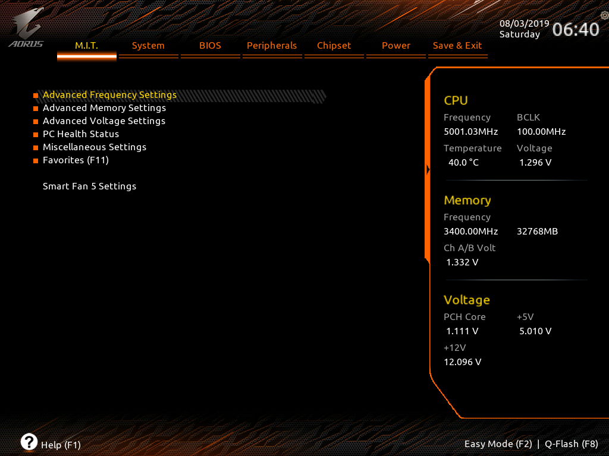
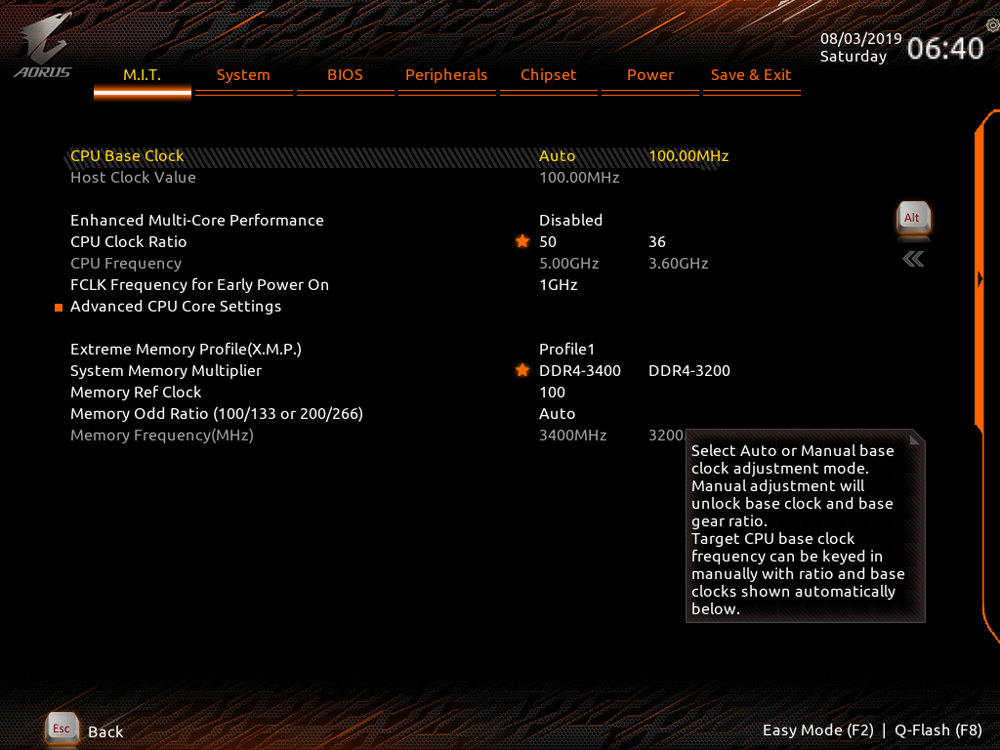
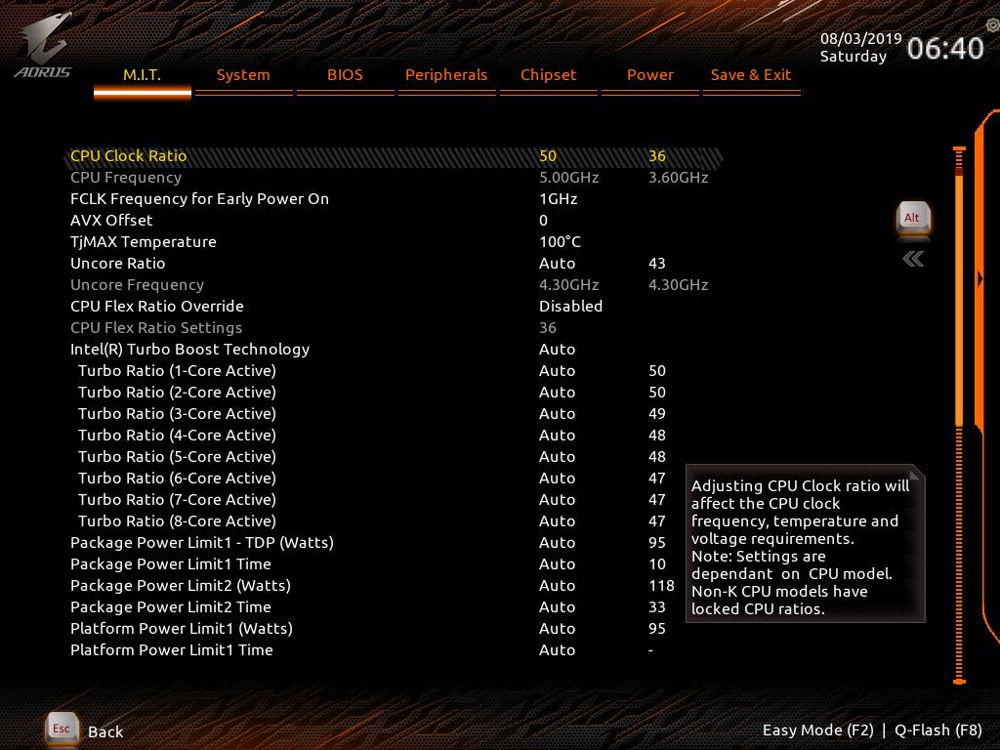
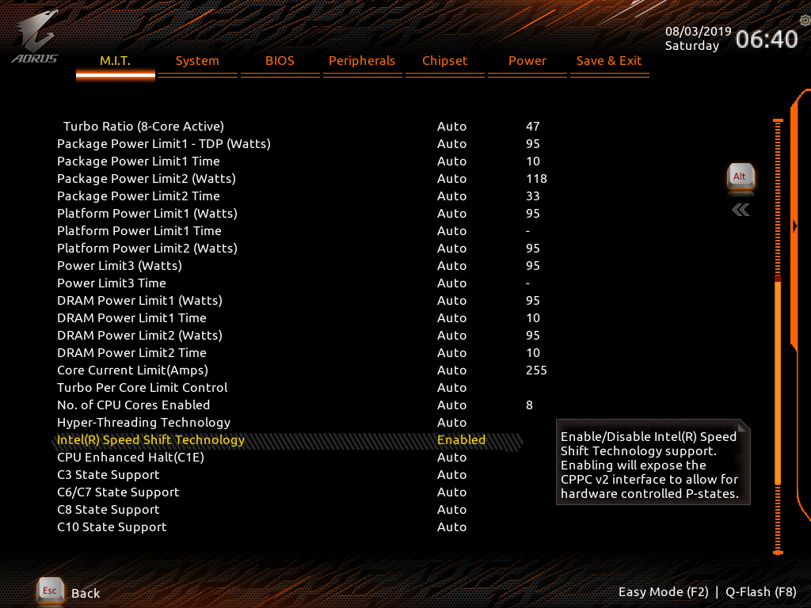
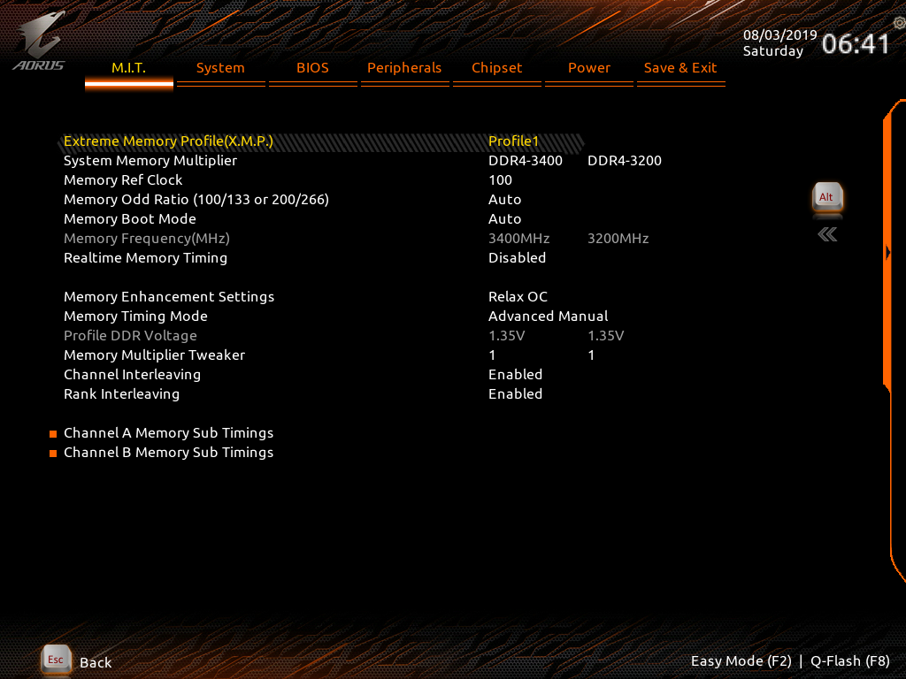
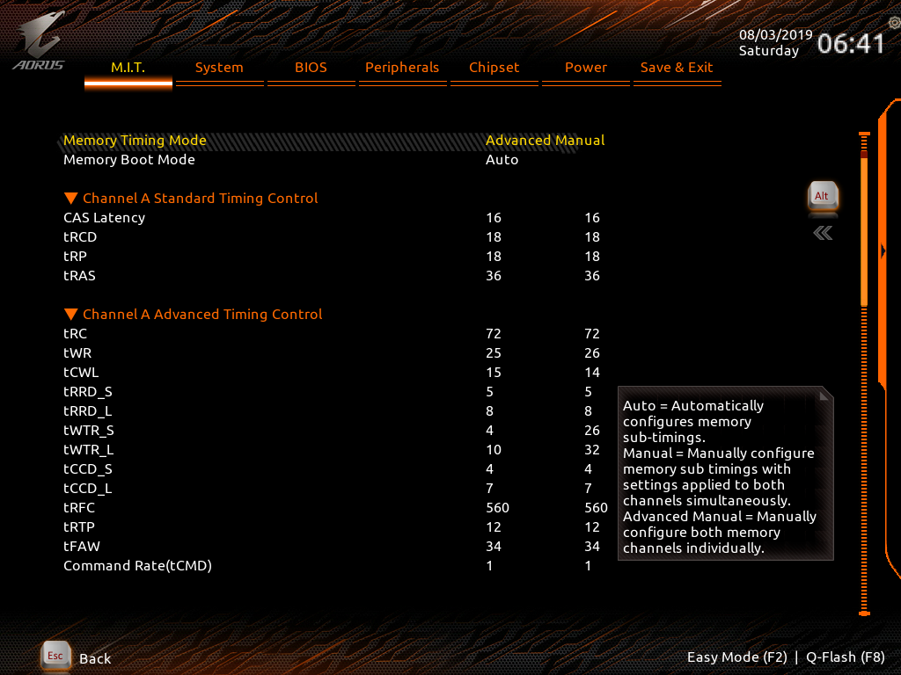
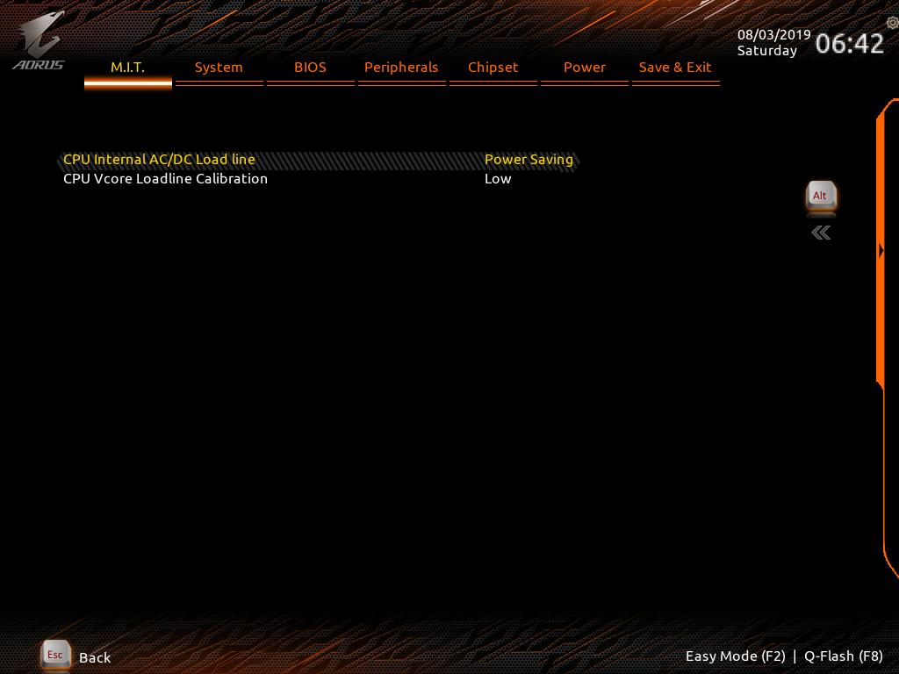
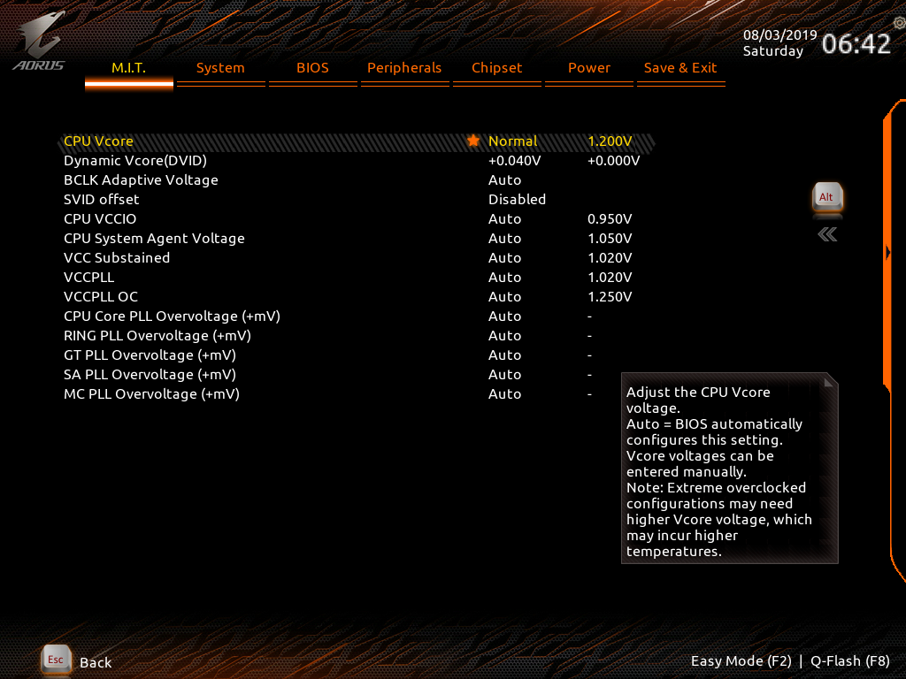
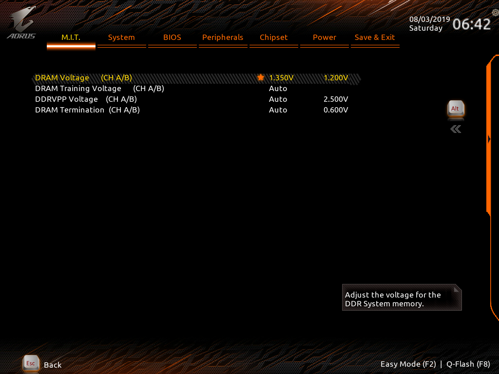

# z390 OC settings

This are my notes about z390 OC settings

## HARDWARE SETUP

* Gigabyte Z390 Aourus PRO
* Intel Core i9 9900KF
* Ballistix Sport AT 2x16GB 3200CL16 (BLS2K16G4D32AEST)

## SUMMARY

## FREQUENCY SETTINGS

## ADVANCED FREQUENCY SETTINGS

## MEMORY SETTINGS

## CHIPSET VOLTAGES

## CPU VOLTAGES

*Dynamic Vcore* +0.040V -> System is stable but gives rounding errors in mprime small FFTs

*Dynamic Vcore* +0.085V -> System is stable, no errors in mprime

## RAM VLOTAGES

